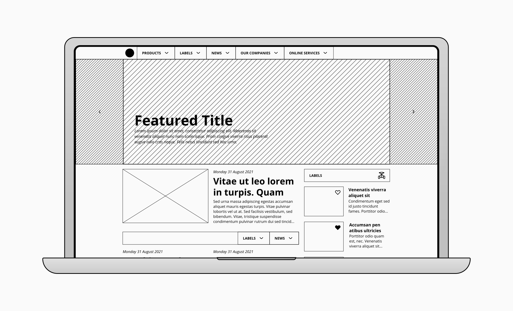
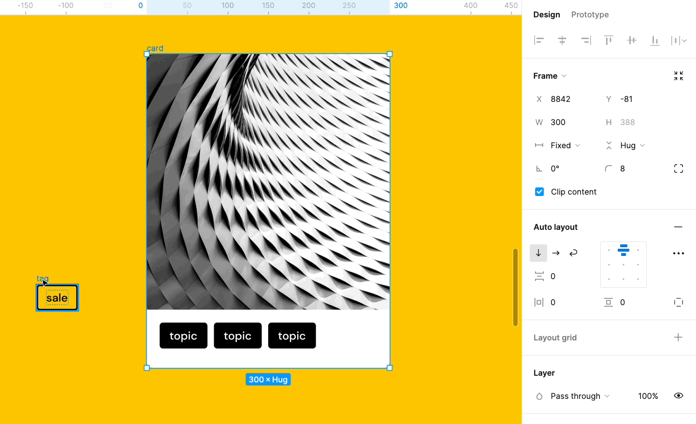

<figure>
  
  <figcaption>Website mockup // wireframes // blueprint by <a href="https://www.figma.com/@martina" target="_blank" rel="noopener noreferrer">Martina</a></figcaption>
</figure>

As I was reading the job offer posted by the company I now work for, something caught my attention: they were looking for a 60% web designer and 40% "code ninja." Perhaps each marketing agency has different requirements, but rarely do these two numbers vary significantly.

I understand that job roles can be quite specific, but in the common market, the exchange of information between designers and developers seems to be increasingly blurred.

---

## New technologies, new terminology

No-code, automation, visual development—just take a look at tools like Figma. They appear colorful and design-oriented, but recently they have expanded their functionality to allow developers to explore component structure and design using HTML and CSS.

If you're just starting out, whether as a designer or a web developer, you will inevitably come across moments where you wish you had knowledge seemingly more aligned with the other field.

*Consider this: if you're a designer, there's a developer sharing that same feeling of frustration, and vice versa.*

### Not essential, but beneficial: understanding the basics of web design and development

A skilled web designer provides all the guidelines and directions to ensure that their design can be replicated 100% in a web environment. So, here comes the big question: what should a web designer know to effectively convey their design to a developer?

#### Grasp common and equivalent terminology

Let's illustrate this with an example. Figma allows you to create almost any type of two-dimensional visual composition. Elements can be freely moved, spaced apart, scaled, and more. It also allows you to follow predefined patterns: you can move elements along a specific axis, space them using defined pixel units, separate them as much as the available space permits, or align them to a side. Essentially, it lets you establish the measurements that make a design meaningful.

<!-- <figure>
  
  <figcaption>Using auto layout by <a href="https://www.figma.com/@martina" target="_blank" rel="noopener noreferrer">Figma.com</a></figcaption>
</figure> -->

<figure>
  
  <figcaption>Using auto layout by <a href="https://www.figma.com/@martina" target="_blank" rel="noopener noreferrer">Figma.com</a></figcaption>
</figure>

Now, here's the CSS equivalent of Figma's auto-layout feature:

```css
.st-row { /* vertical layout */
    display: flex;
}

.sp-ga--m {
    gap: 16px;
}
```

Doesn't it seem like designers and developers are sculpting the same artwork but with different chisels? I don't know if it's the perfect analogy, but designers often find themselves working around this concept: "design using my tool, and that'll explain to you what I've done."

#### The reason for misunderstanding between developers and designers

When a fully skilled developer struggles to bring a design to production, it can be attributed to different factors. However, in this article, let's focus on one factor—the unavoidable one: designers and developers speak different languages.

Let's go back to Figma for a better understanding. If we place two elements randomly in a frame, we end up with some freely positioned objects; in other words, elements with dreaded position: absolute. While Figma shows what a web browser would interpret for that design, the developer will do the same and try to interpret it. Of course, the developer won't fill a website with absolute positioning everywhere—it's not a good practice. Instead, they'll find the closest approach to this non-specific design. On the other hand, if the designer explains the relationship between these two elements, the developer won't need to guess. Are these elements within the same block? Do they have a specific aspect ratio? Are they aligned along any axis? Does either of them need additional space when they get too close on narrower screens?

The more information the designer provides, the more effective the communication will be in creating the final product.

## How I would approach the issue

Now, let me share my personal perspective on this matter. I believe the real solution isn't about training designers in coding or developers in design. Yes, that would be an ideal solution, but I don't consider it very effective. Instead, the key lies in creating a motivating environment for designers. Personally, I think I was fortunate enough to be equally interested in exploring both fields—maybe leaning more towards one on some days and the other on different days. And I've found that whether you work for an agency or as a freelance, clients appreciate this versatility. Not only that, but I believe a multidisciplinary profile in this regard is infectious.

In conclusion, bridging the gap between design and web development brings numerous advantages for both professionals and the final product. Improved collaboration, informed decision-making, and consideration of scalability and defined styles lead to more efficient development and an enhanced user experience. Embracing a multidisciplinary mindset can boost creativity and innovation, benefiting the overall design and development process.
