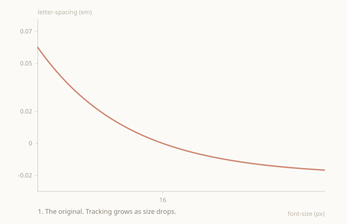
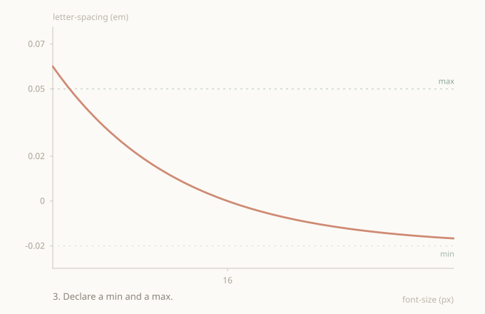
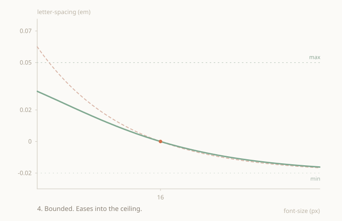
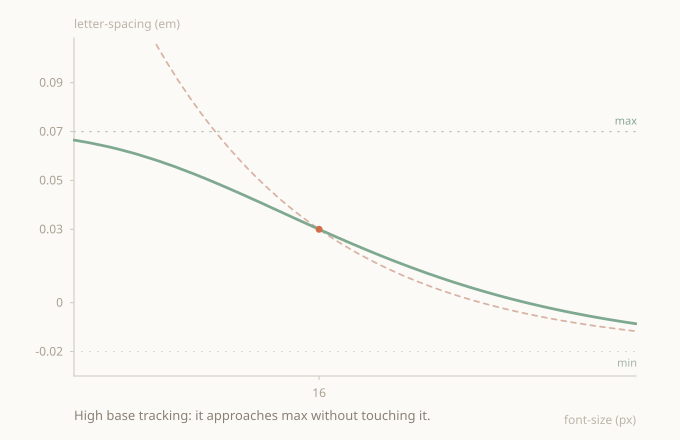

## The shift

The interesting part of all this isn't the formula. It's who decides the values.

The usual way is that design dictates them. If the existing scale happens to fit, great, and if not the dev tokenizes whatever's loose, which is really just hardcoding with extra steps. Do that enough times and the work starts to feel like data entry, where each size is a number that someone typed in by hand because design asked for it.

What I wanted was to flip that. Instead of a model that produces values, a model that produces a curve. One continuous surface, defined by a handful of parameters that actually mean something, and design picks where to land on it.

Size drives the whole thing. Any font size already has its tracking, because the curve passes through every point. The dev doesn't ask for "the value at 23px", they write 23px and the tracking is there. You define the curve once and design works on top of it. That's less, not more: fewer tokens, fewer maps, fewer steps in between.

> The point isn't the micro-solution itself. It's a mindset where design and dev fit together as one thing, and each role picks up its part inside a controlled space.

## Why not token by token

The common approach is to add values one at a time and let the patterns emerge as you go. On a small site that's fine, because few sizes and few hands means the eye keeps it coherent.

It breaks at scale. When ten devs are merging at once, each adding their own token when they need it, you end up with maybe half of the potential the system had. Whatever coherence the design was supposed to carry gets diluted across decisions taken at different times by different people. And there's never really a good moment to stop and unify it all, because there's always an open branch.

A curve flips that situation. There's nothing to add one by one, just a definition that lives in one place, and the consistency isn't something ten people need to remember because the formula gives it to you for free. The dev doesn't invent the tracking for a new size, they read it off the curve. Merge conflicts over tracking values disappear, because there are no values to touch, only parameters you change on purpose.

This is what I'd call controlled tokenization. You reduce the surface area of decisions without losing control over the outcome, and the small adjustments that quietly wear devs and designers down stop being a daily thing.

## Where it came from

The starting point for me was a page by Adonis Raul Raduca, <a href="https://precise-type.com/models-letter-spacing.html" target="_blank" rel="noopener">precise-type.com</a>, which collects models for a coherent type system across size, line height and letter spacing.

The letter spacing model there is reciprocal, and the underlying idea is right. Tracking decreases as size grows, and the whole thing is anchored to a base pair:

```
letter-spacing = (base-letter-spacing + 3) * base-font-size / font-size - 3
```

The 3, or 0.03 in the em variant, sets where the curve tends at large sizes. As a conceptual base it's solid, but as I started using it I realised it leaves one side of the problem open.

## The curve runs away at small sizes

<figure>
  
  <figcaption>The original reciprocal model: tracking falls as size grows and settles into a lower asymptote. No upper bound.</figcaption>
</figure>

The model only has one asymptote, and it's at the bottom. It tends to a value at large sizes, but at the top it just grows. The smaller the size, the more tracking, with no ceiling at all, and by the time you get to 1px the value is already absurd.

What fails on screen isn't the look, it's control. The curve runs away in small sizes and there's no way for you to cap it, which means the model is deciding the extremes for you. What was missing was obvious: a max declared the same way there's a min, so that the designer sets both bounds and the curve respects them.

## The path to the model

Getting there took a few stops, and each one ruled something out.

First, exposing the constant as a variable, so that the curvature wasn't frozen anymore. Then, trying to add a real upper asymptote with a logistic over log size, the classic sigmoid:

```
ls(s) = min + (max - min) / (1 + e^(-k (ln s - ln s0)))
```

It gives you two bounds, but it breaks the reciprocal form and loses the exact anchor, since a logistic isn't pinned to a base pair the way the original is. A damped reciprocal solves part of it instead, adding the ceiling with a single shift d in the denominator:

```
ls(s) = (track + c) * base / (s + d) - c
```

That d keeps the curve from blowing up and preserves the anchor, but it gives no real control over the shape of the transition. The next idea was to declare min and max as bounds directly, in a clamp-like way, and have the curve reach them as asymptotes.

<figure>
  
  <figcaption>Same curve, now with explicit min and max declared as horizontal bounds the curve must stay within.</figcaption>
</figure>

I also tried moving into the log domain, where a straight line means tracking that decreases in perceptually equal steps, saturated between the bounds with a tanh:

```
ls(s) = mid + amp * tanh(slope * (ln s - ln base))
```

And a purely algebraic sigmoid, rational and cheaper to reason about, with u = slope (ln s - ln base):

```
ls(s) = mid + amp * u / sqrt(1 + u^2)
```

It's worth noting the logistic and the tanh are the same sigmoid reparametrized (tanh(x) = 2·logistic(2x) - 1), so those two attempts were really one family seen from two angles.

The tension was the same every time. Either the curve follows the original closely, or it eases out at the extremes, but not both at once, and forcing them together always produced a visible kink.

## Saturate with an exponential

The piece that finally made it work was to take the original's height above the floor and compress it toward the ceiling with a decreasing exponential. It's the smoothest way to approach a limit, because it brakes in proportion to what's left, and it reaches the ceiling with a horizontal tangent, with no kink. In the working range it follows the original closely, and at the extremes it settles under the ceiling.

<figure>
  
  <figcaption>Original (dashed) vs the final bounded model (solid). They cross at the base size and only diverge near the extremes, where the new model saturates under the ceiling.</figcaption>
</figure>

## The audit collapsed the formula

When I sat down to audit the math, almost everything cancelled out. The raw original, the anchor parameter, the exponential with its logarithm, all of it turned out to be an algebraic detour leading to the same place.

The final form, identical down to floating point noise, is just a power:

```
ls(s) = max - (max - min) * r^(base / s)
r     = (max - base) / (max - min)
```

There are four parameters that you actually control (base, track, min, max), one trivial derived value (r), and the whole thing is a power with no transcendental functions in sight. It helps to see that r^(base/s) is e^(ln(r) · base/s), a plain exponential in 1/s, which is exactly why it inherits the smooth saturation without carrying any of the machinery. In CSS it's native via `pow()`, which has been available in every modern browser since late 2023.

## What the model guarantees

Random-case auditing didn't turn up anything serious, and there are a few things that always hold:

- Exact anchor. At base size the result is exactly the base track.
- Strict monotonicity. Tracking decreases without bumps as size grows.
- Hard bounds. The curve never leaves the min to max interval.
- Smooth exit. It reaches the bounds with a horizontal tangent, no kink.

The only real validity condition is that base sits between min and max, which is equivalent to r being between 0 and 1. A guard stops compilation if that breaks, so you don't ship a broken curve by accident.

## When the ceiling kicks in

With soft parameters, like a base track at zero, the curve barely touches the ceiling and the max ends up acting as a safety net more than anything else. But there are cases where the ceiling is the thing actually carrying the curve, and they're worth pointing out: a sizable base tracking, where the curve starts high and opens up fast as size drops, and genuinely small sizes, where the reciprocal form would run away on its own no matter how modest the base track is.

<figure>
  
  <figcaption>With a high base tracking, the curve climbs fast at small sizes and settles against the max as a smooth upper asymptote, never crossing it.</figcaption>
</figure>

In both situations the curve climbs, approaches the max, and settles on it with a horizontal tangent without ever crossing. That's what makes the model viable: it isn't a curve that only works in the comfortable case, it holds at the edges too, because both ends are bounded and not just one.

## Sample values

With base 16px, track 0, min -0.02, max 0.05, on a 1.19 ratio scale, the model produces these values across a normal scale:

| step | px | original (em) | model (em) |
|------|-----|---------------|------------|
| s | 13 | 0.0038 | 0.0031 |
| m | 16 | 0.0000 | 0.0000 |
| l | 19 | -0.0032 | -0.0028 |
| xl | 23 | -0.0059 | -0.0052 |
| 2xl | 27 | -0.0081 | -0.0073 |
| 3xl | 32 | -0.0100 | -0.0092 |
| 4xl | 38 | -0.0116 | -0.0108 |
| 5xl | 45 | -0.0130 | -0.0122 |
| 6xl | 54 | -0.0141 | -0.0134 |
| 7xl | 64 | -0.0150 | -0.0144 |

Across the real range the two curves are nearly identical, with a max difference of about 0.08 percent. The m step anchors at exactly 0, and from there tracking tightens smoothly toward the displays.

The two models only diverge at tiny sizes, well outside a normal scale:

| px | original (em) | model (em) |
|----|---------------|------------|
| 10 | 0.0120 | 0.0091 |
| 8 | 0.0200 | 0.0143 |
| 6 | 0.0333 | 0.0215 |
| 4 | 0.0600 | 0.0318 |
| 2 | 0.1400 | 0.0453 |
| 1 | 0.3000 | 0.0497 |

The original heads for 0.30em at 1px, while the model settles under the 0.05em ceiling and never crosses it. A scale starting around 13px never reaches that territory, so in normal use the ceiling is a safety net rather than a visible change.

## Implementation

These are the real blocks I'm using in the system, just the relevant pieces and not the whole files.

The function that computes r and guards the validity condition:

```scss
@function t-ls-ratio($ls-base, $ls-min, $ls-max) {
    @if $ls-base <= $ls-min or $ls-base >= $ls-max {
        @error "t-ls-base (#{$ls-base}) must sit between t-ls-min (#{$ls-min}) and t-ls-max (#{$ls-max}).";
    }
    @return math.div($ls-max - $ls-base, $ls-max - $ls-min);
}
```

The three parameters, with the rule on one line:

```scss
// ls saturates into [min, max]: max at small sizes, min at large; base must sit between
$t-ls-base: 0;
$t-ls-min:  -0.02;
$t-ls-max:  0.05;
```

The custom properties and the letter-spacing line that ties it all together:

```scss
--t-ls-max:     #{$t-ls-max * 1em};
--t-ls-span:    #{($t-ls-max - $t-ls-min) * 1em};
--t-ls-r:       #{t.t-ls-ratio($t-ls-base, $t-ls-min, $t-ls-max)};
--t-ls-base-px: #{$t-size-base * 1px};
```

```scss
letter-spacing: calc(var(--t-ls-max) - var(--t-ls-span) * pow(var(--t-ls-r), var(--t-ls-base-px) / 1em));
```

The interesting bit is the exponent. `base / s` is written as `var(--t-ls-base-px) / 1em`, and the `1em` resolves against the element's own font size, so the browser computes the power live for each size. One valid CSS value covers the whole scale, with no token per size.

## Why the origin model didn't fit clamp

The type system I work with is fluid, so each size is a clamp interpolating between a viewport min and max:

```scss
@function px-clamp($min, $max) {
    $s: _slope($min, $max);
    $i: _intercept($min, $s);
    @return clamp(
        #{convert.to-rem($min)},
        calc(#{$s * 100}vi + #{convert.to-rem($i)}),
        #{convert.to-rem($max)}
    );
}
```

A step's rendered size isn't fixed, it moves with viewport width: a step that's 28px on a narrow screen might be 32px on a wide one. The em tracking is computed on that rendered size, so it moves with the viewport too, which means a single token doesn't have one tracking value, it has a range that tracks the size.

The origin model couldn't really handle this, because its formula needs the size at compile time. The power form solves it because the em trick leaves the whole evaluation to the browser, and `pow(r, base / s)` simply recomputes itself with whatever s applies at each viewport.

## On calibration

What this gives you is a coherent base curve, but what it doesn't know is how a specific typeface actually looks at each size. Optical tuning depends on the family, and two fonts at the same size can want different tracking. That fine adjustment is a designer's job, done by tuning the parameters rather than by overwriting loose values by hand, because patching tokens breaks the consistency that justified having a model in the first place.

Calibration has its limits, and I think design should too once we go into fine optics. A sane curve that anchors and respects its bounds already handles ninety-something percent of the work, and the rest is debatable, often more about ego than craft.

> Taking this to production. It'll work. The values make sense, the curve is coherent across the scale, anchors where it should and respects the bounds it's given. What's left is calibrating against the real font by tuning parameters, not by patching tokens.

## Where it lands

The model stays coherent with the origin, keeps its reciprocal form and its anchor, and adds the piece that was missing: a declarable max acting as a smooth asymptote. The math is minimal, a power with nothing spare, and it's been verified against a real compiler. It ships with native `pow()` and a guard protecting the one validity condition that actually matters.
