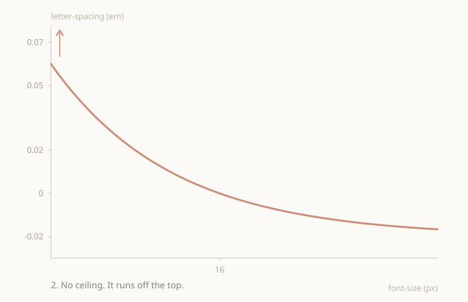

## The shift

The interesting part here isn't the formula. It's who decides the values.

The usual way: design dictates the values. If the existing scale happens to fit, good. If not, the dev tokenizes the loose ones, which is almost like hardcoding, a value entered once and left there. Do that enough and the work turns into data entry. Each size is a number someone typed in by hand because design asked for it.

Flip it. The model doesn't produce values, it produces a curve. One continuous curve, infinite points, defined by a few parameters that mean something. There's no tracking table to type out. There's a surface, and design picks where to land on it.

Size drives. Any font size already has its tracking, because the curve passes through every point. A dev doesn't ask for "the value at 23px", they use 23px and the tracking is there. Define the curve once, design works on top of it.

This is less, not more. Fewer tokens, fewer maps, fewer steps in between.

> The point isn't the micro-solution itself. It's a mindset where design and dev actually fit together as one thing, and each role picks up its part in a controlled space.

## Why not token by token

The common approach is to add values one at a time and spot patterns as they show up. On a small marketing site it's fine. Few sizes, few hands, the eye keeps it coherent.

It breaks at scale. Ten devs merging at once, resolving conflicts, each adding their token when they need it, and you get maybe fifty percent of the potential. The patterns a coherent design should have get diluted across decisions made at different times by different people.

There's never a perfect moment to stop and unify. There's always an open branch. The more complexity and more hands, the harder DRY and consistency fall.

The model flips that too. No tokens to add one by one, a curve defined in one place. Consistency isn't something ten people have to remember, the formula guarantees it. A dev doesn't invent the tracking for their new size, they take it from the curve. Merge conflicts over tracking values just disappear, because there are no values to touch, only parameters you change on purpose.

This is controlled tokenization. You reduce the surface area of decisions without losing control over it. Fewer micro-adjustments that wear devs down, fewer micro-decisions that wear everyone down. Shipping gets more direct.

## Where it came from

The starting point was a page, <a href="https://precise-type.com/models-letter-spacing.html" target="_blank" rel="noopener">precise-type.com</a>, by Adonis Raul Raduca. It collects models for a coherent type system: size, line height, letter spacing.

Its letter spacing model is reciprocal, and the idea is right. Tracking decreases as size grows, and it anchors to a base pair:

```
letter-spacing = (base-letter-spacing + 3) * base-font-size / font-size - 3
```

The 3, or 0.03 in the em variant, sets where the curve tends at large sizes. As a conceptual base it's solid.

## The curve runs away at small sizes

<figure>
  
  <figcaption>The original reciprocal model: tracking falls as size grows and settles into a lower asymptote. No upper bound.</figcaption>
</figure>

The model only has one asymptote, at the bottom. It tends to a value at large sizes, but at the top it grows without limit.

The smaller the size, the more tracking, no ceiling. At 1px the value is absurd.

<figure>
  
  <figcaption>Extended toward small sizes, the original curve has no ceiling and climbs out of frame.</figcaption>
</figure>

On screen, what fails isn't the look, it's control. The curve runs away in small sizes and there's no way to cap it. The model decides the extremes for you.

What was missing: declaring a max the same way there's a min. Designer sets both bounds, the curve respects them.

## The path to the model

Several stops, each ruled something out.

Expose the constant as a variable, so curvature isn't frozen.

Add a real upper asymptote. A logistic over log size has two bounds but breaks the reciprocal form and loses the exact anchor.

A damped reciprocal adds the ceiling with one denominator shift, keeps the anchor, but gives no control over the transition shape.

Declare min and max directly as bounds, clamp style, and have the curve reach them as asymptotes.

<figure>
  
  <figcaption>Same curve, now with explicit min and max declared as horizontal bounds the curve must stay within.</figcaption>
</figure>

Move into the log domain, where a straight line means tracking that decreases in perceptually equal steps, with smooth saturation between bounds.

Same tension every time. Either the curve follows the original closely, or it eases out at the extremes, not both at once. Force them together and you get a kink.

## Saturate with an exponential

Take the original's height above the floor and compress it toward the ceiling with a decreasing exponential. It's the smoothest way to approach a limit, because it brakes in proportion to what's left. It reaches the ceiling with a horizontal tangent, no kink.

In the working range it follows the original, at the extremes it settles under the ceiling.

<figure>
  
  <figcaption>Original (dashed) vs the final bounded model (solid). They cross exactly at the base size and only diverge near the extremes, where the new model saturates under the ceiling.</figcaption>
</figure>

## The audit collapsed the formula

Auditing the math, almost everything cancelled. The raw original, the anchor parameter, the exponential with its logarithm, all of it was an algebraic detour.

The final form, identical down to floating point noise, is a power:

```
ls(s) = max - (max - min) * r^(base / s)
r     = (max - base) / (max - min)
```

Four parameters you control: base, track, min, max. One trivial derived value, r. A power, no transcendental functions.

In CSS it's native via `pow()`, available in every modern browser since late 2023.

## What the model guarantees

Random-case auditing found no serious issues. These always hold:

- Exact anchor. At base size the result is exactly the base track.
- Strict monotonicity. Tracking decreases without bumps as size grows.
- Hard bounds. Never leaves the min to max interval.
- Smooth exit. Reaches the bounds with a horizontal tangent, no kink.

The only validity condition is that base sits between min and max, which is the same as r being between 0 and 1. A guard stops compilation if that breaks, instead of shipping a broken curve.

## When the ceiling kicks in

With soft parameters, like a base track of zero, the curve barely touches the ceiling. The floor leads, the max stays a safety net. But the ceiling isn't decorative. There are cases where it carries the curve.

First, starting from a sizable base tracking. If base track is already open, the curve starts high and hits the ceiling fast as size drops. Without a max it would keep climbing. With it, it flattens against the limit.

Second, reaching genuinely small sizes. The reciprocal form runs away the smaller you go. However modest the base track, drop far enough and the original heads for absurd values. The ceiling stops it.

<figure>
  
  <figcaption>With a high base tracking, the curve climbs fast at small sizes and settles against the max as a smooth upper asymptote, never crossing it.</figcaption>
</figure>

In both, the upper asymptote shows up. The curve climbs, approaches the max and settles on it with a horizontal tangent, never crossing. That's what makes it viable. Not a curve that only works in the comfortable case. It holds with large base tracking and tiny sizes too, because both ends are bounded, not just one.

## Sample values

Base 16px, track 0, min -0.02, max 0.05, on a 1.19 ratio scale:

| step | px | original (em) | model (em) |
|------|-----|---------------|------------|
| s | 13 | 0.0038 | 0.0031 |
| m | 16 | 0.0000 | 0.0000 |
| l | 19 | -0.0032 | -0.0028 |
| xl | 23 | -0.0059 | -0.0052 |
| 2xl | 27 | -0.0081 | -0.0073 |
| 3xl | 32 | -0.0100 | -0.0092 |
| 4xl | 38 | -0.0116 | -0.0108 |
| 5xl | 45 | -0.0130 | -0.0122 |
| 6xl | 54 | -0.0141 | -0.0134 |
| 7xl | 64 | -0.0150 | -0.0144 |

Across the real range the two curves are nearly identical, max difference about 0.08 percent. m anchors at exactly 0. From there tracking tightens smoothly toward the displays. Sensible values, nothing extreme.

The two models only diverge at tiny sizes, outside a normal scale:

| px | original (em) | model (em) |
|----|---------------|------------|
| 10 | 0.0120 | 0.0091 |
| 8 | 0.0200 | 0.0143 |
| 6 | 0.0333 | 0.0215 |
| 4 | 0.0600 | 0.0318 |
| 2 | 0.1400 | 0.0453 |
| 1 | 0.3000 | 0.0497 |

The original heads for 0.30em at 1px. The model settles under the 0.05em ceiling and never crosses. A scale starting around 13px never reaches it, so in normal use the ceiling is a safety net, not a visible change.

## Implementation

Real blocks using the model. Only the relevant pieces, not the whole files.

The function that computes r and guards validity:

```scss
@function t-ls-ratio($ls-base, $ls-min, $ls-max) {
    @if $ls-base <= $ls-min or $ls-base >= $ls-max {
        @error "t-ls-base (#{$ls-base}) must sit between t-ls-min (#{$ls-min}) and t-ls-max (#{$ls-max}).";
    }
    @return math.div($ls-max - $ls-base, $ls-max - $ls-min);
}
```

The three params, rule in one line:

```scss
// ls saturates into [min, max]: max at small sizes, min at large; base must sit between
$t-ls-base: 0;
$t-ls-min:  -0.02;
$t-ls-max:  0.05;
```

Custom properties and the letter spacing line:

```scss
--t-ls-max:     #{$t-ls-max * 1em};
--t-ls-span:    #{($t-ls-max - $t-ls-min) * 1em};
--t-ls-r:       #{t.t-ls-ratio($t-ls-base, $t-ls-min, $t-ls-max)};
--t-ls-base-px: #{$t-size-base * 1px};
```

```scss
letter-spacing: calc(var(--t-ls-max) - var(--t-ls-span) * pow(var(--t-ls-r), var(--t-ls-base-px) / 1em));
```

The trick is the exponent. `base / s` is written as `var(--t-ls-base-px) / 1em`. The `1em` resolves against the element's own font size, so the browser computes the power live for each size. One valid CSS value for the whole scale, no token per size.

## Why the origin model didn't fit clamp

The type system is fluid. Each size is a clamp interpolating between a viewport min and max:

```scss
@function px-clamp($min, $max) {
    $s: _slope($min, $max);
    $i: _intercept($min, $s);
    @return clamp(
        #{convert.to-rem($min)},
        calc(#{$s * 100}vi + #{convert.to-rem($i)}),
        #{convert.to-rem($max)}
    );
}
```

A step's rendered size isn't fixed, it moves with viewport width. A step that's 28px on a narrow screen can be 32px on a wide one.

The em tracking is computed on that rendered size, so it moves with the viewport too. A single token doesn't have one tracking value, it has a range that tracks the size.

The origin model wouldn't handle this well, its formula needs the size at compile time. The power form solves it because the em trick leaves the whole evaluation to the browser. `pow(r, base / s)` recomputes itself with whatever s applies at each viewport. Just know that a token's tracking is a range, not a number.

## On calibration

This gives a coherent base curve. What it doesn't know is how a specific typeface looks at each size.

Real optical tuning depends on the family. Two fonts at the same size can want different tracking. That fine adjustment is a designer's job, done by tuning the parameters, not overwriting loose values by hand. Patching tokens breaks the consistency that justifies having a model.

Calibration has limits, and design should too if we're going into fine optics. You can chase the perfect pixel at every step for every font. Past a point that stops being design and turns into obsession, and the system's consistency is worth more than the perfect tuning of a single value. A sane curve that anchors and respects bounds already handles ninety-something percent. The rest is debatable, and usually ego.

> Taking this to production. It'll work. The values make sense. The curve is coherent across the scale, anchors where it should, respects the bounds it's given. What's left is calibrating against the real font by tuning parameters, not patching tokens.

## Where it lands

Coherent with the origin model, keeps its reciprocal form and its anchor, adds what was missing: a declarable max acting as a smooth asymptote.

Minimal math, a power with nothing spare, verified against a real compiler. Ships with native `pow()` and a guard protecting the one validity condition.
