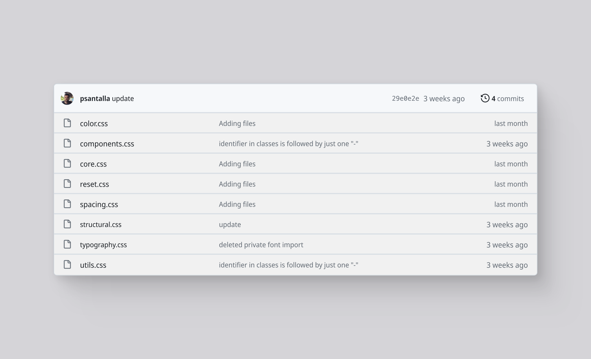

<figure>
  
  <figcaption>Website mockup // wireframes // blueprint by <a href="https://www.figma.com/@martina" target="_blank" rel="noopener noreferrer">Martina</a></figcaption>
</figure>

There's a difference between knowing CSS and knowing how to write CSS. When I started applying styles to my early websites, I remember creating classes haphazardly, without paying much attention to how those lines would impact the scalability of the project. I wanted to style a button, so I created .button; I wanted a bordered text block, so I created .text-block.

It's normal to work this way, and in small projects, it might even be the most efficient option. However, you should be aware that the way you structure your classes, even how you name them, can be crucial in limiting whether your project continues to grow or reaches a point where making changes becomes more complicated than it should be.

---

## What to Consider Before Writing Your First Line of CSS

There are different aspects to consider when writing code in general, but to simplify things, let's focus on two very important ones:

- Classification
- Naming

The truth is, browsers don't care about how you name your classes or where you place them. As long as they're valid, the outcome won't change. Keep this in mind so you don't obsess over it too much, because we're not talking about performance optimization here; we're talking about how we and our colleagues will be able to reinterpret and understand what that CSS does and how changes affect the overall web.

A premise I always consider when writing CSS is that the purpose of creating a class should fulfill one of the following two objectives: either we create a class because we anticipate making changes to an element in the future, or we create a class because we want to apply styles more than once to different elements.

### Classification

How we group our classes is crucial for future locating and making changes to them. For me, classification or grouping has two properties: localization and segmentation.

- Localization: it's the path where this style guide exist.
- Segmentation: it's how we group classes. For example, we put classes that affect structures like grid, flex, or block together, and others that affect font size or typographic styles in another place.

*We can even localize further and say that a certain class should be at a certain point in our document, but personally, this feature varies a lot depending on each project, and establishing rules is complicated. Still, I think it's normal to follow certain criteria, such as using font styles higher up in the document and importing font families at the beginning, or leaving classes that apply embellishment styles like shadows for the end. But this is subjective and also depends on the project.*

Localization is easy to understand. We need to determine where we put our styles; perhaps in /styles/css or in /styles/css/buttons. It's important to be aware of where these styles are routed and know which parts of our HTML they link to.

Segmentation, however, deserves a slightly more extensive explanation.

#### CSS segmentation

By segmentation, I mean how we isolate classes — and as we'll see, properties too — that share similar functions. Over time, I've realized that I can group CSS classes in different documents to keep everything more organized:

##### reset.css

Also sometimes named normalize.css, depending on its function, this is usually a document that resets properties browsers set by default. Without going into too much detail, browsers add predefined styles to make our HTML produce minimally readable, responsive pages with spacing between elements, even without writing a single line of CSS.

Personally, I use a modified version of the reset by <a href="https://meyerweb.com/eric/tools/css/reset/" target="_blank" rel="noopener noreferrer">Meyerweb</a>.

##### structural.css

Here are the classes that affect the structure of elements, and by element, I mean any HTML tag, such as `<body>` or `<p>`. Structural classes allow us to modify the layout of sub-elements. Examples of this include using flex or grid properties.

```css
/* examples of structural classes */
.st-row {
    display: flex;
}

.st-col {
    display: flex;
    flex-direction: column;
}

.st-inline {
    display: inline;
}

.st-grid {
    display: grid;
}
```

##### typography.css

This is where all the classes and CSS related to fonts go. From importing the font family to the weight and size of each text block, it should all go here. To make it clearer, while there are properties like margin that affect any element, others like text-transform will only affect typographic style. Here, only those that exclusively modify text go.

##### color.css

You can probably guess what goes here. I'll always put classes that affect color in this document, whether it's a border, background, or directly an element's color. Here's an excerpt:

```css
.c-el--pine {
    color: var(--c--pine);
}

.c-bg--pine {
    background-color: var(--c--pine);
}
```

##### spacing.css

Margins, paddings, and gaps essentially. I like combining structural classes with spacing. For example, look at this consistent way of spacing text blocks in an article.

```html
<style>
    .st-col {
        display: flex;
        flex-direction: column;
    }

    .sp-ga--m {
        gap: var(--sp--m);
    }
</style>

<div class="st-col sp-ga--m">
    <h1>This is an H1</h1>
    <p>This is the first paragraph</p>
    <p>This is the second paragraph</p>
</div>
```

*The .st-col class creates a flex with a column direction and enables the use of the gap property, used in the following class. This way, we consistently space elements without repeatedly applying bottom margins.*

##### utils.css

Here go classes containing specific properties that intuitively don't fit into the previous groups. These properties include opacity, which affects color and we could place it in color, but we use it without considering color and for purposes other than "coloring" structures; also borders, corner radii, or even classes that hide or reveal elements. As you can see, some classes arguably fit into other groups: display: none is itself a type of structure, just like display: flex, but intuitively we struggle to place it here. My recommendation is to explore the type of properties you usually use in your projects, find it hard to locate or assign dependencies to other properties, and put them here.

##### components.css

Honesty above all: I hate this document. Here go styles that use unrelated properties. A clear example is a card or .card, which we use to style padding, border, or background color. We could apply classes from previous groups to this element to style it without using the .card class, but we'd need too many classes. My rule is: if I need to apply more than 4 classes to an element, I consolidate all the properties of these classes into a component-type class.

```html
<div class="st-col c-bg--alabaster sp-pa--m ut-border--sc"></div>
<div class="com-card"></div>
```

And that's all about how I group CSS classes!

### Naming of classes

If you end up naming your classes with names that are hard to remember or difficult for others to interpret, I recommend looking into established naming conventions; an example of this is <a href="https://getbem.com/introduction/" target="_blank" rel="noopener noreferrer">BEM</a>, but you can also explore how some frameworks like <a href="https://tailwindcss.com/" target="_blank" rel="noopener noreferrer">Tailwind</a> or <a href="https://getbootstrap.com/" target="_blank" rel="noopener noreferrer">Bootstrap</a> do it.

As a general rule, we should use naming to explain what properties the class contains. And in my particular case, I like the class name to point to its group. I do this because when I see an applied class on an element, I can go directly to its group and make changes faster. It's also useful for organizing classes that affect an element and working on order; as we saw in a previous example, if I find a gap spacing class applied without a preceding flex structure, I'll know I'm making an inconsistency.

This starting naming convention is as follows:

- structural.css (.st-)
- color.css (.c-)
- utils.css (.ut-)
- components.css (.com-)
- typography.css (.t-)
- spacing.css (.sp-)

I hope this guide provides a starting point for better organization and semantic meaning in your CSS. If you want to take a look at the complete code or reuse structures, check out this class system I named <a href="https://github.com/psantalla/catalyst" target="_blank" rel="noopener noreferrer">Catalyst</a>.
