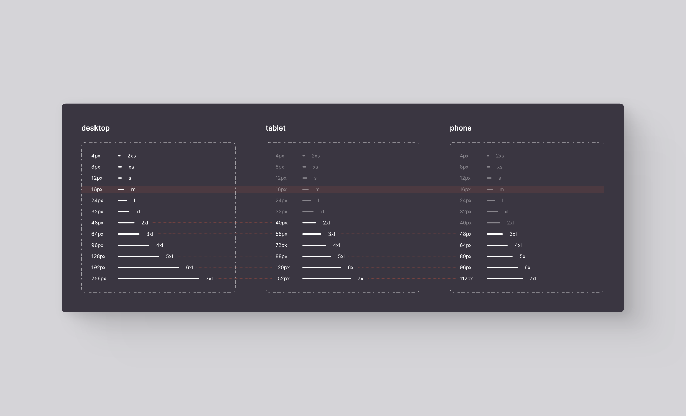

When discussing spacing in web design, it's essential to distinguish between two types:

- Two-dimensional spacing
- Depth

---

## Why Spacing Matters

Even though website visitors may not pinpoint visual inconsistencies precisely, they do notice them.

As web designers, we use terminology to identify visual patterns, hierarchies, and consistencies.

*A web designer's role is to guide the user's natural gaze to their desired content.*

The most frequently visited websites, not necessarily the flashiest ones, establish visual patterns that make users feel comfortable. The repetition of navigation flows, similar to walking or driving along familiar routes, creates a sense of security. It's not just the flows; what users encounter along the way greatly influences their experience. We navigate more comfortably when we understand how streets and highways connect, the width of lanes, or the locations of intersections. Visual references like traffic signs or lane markings also contribute to our comfort. Most importantly, we appreciate knowing that for different routes, we'll have a similar experience if our references follow these learned patterns. You've probably noticed the close relationship between "experience" and "user."

Spacing is another element of this experience. It's crucial because it's intrinsic to our understanding of the world. We bring related objects closer together, sometimes grouping them tightly or placing them at specific distances, making room for other objects or ourselves.

If I give you four chairs and a square table, you'll arrange them similarly to how I would. If I add another chair, you'll face the same challenge. If I provide a sixth chair and a second table with two more chairs, we'll rearrange them similarly. Following familiar patterns allows us to navigate the world with confidence. These behaviors also apply to the digital realm.

## Spacing Direction

In our two-dimensional web world, we can break down spacing into two main categories:

- Vertical spacing
- Horizontal spacing

*Some designers work with both types equally. Personally, I don't consider it a major mistake, but it can significantly impact the final user experience.*

I distinguish between vertical and horizontal spacing for a straightforward reason: space serves functionality, not aesthetics. Vertical and horizontal spacing serve different functions.

Reading or analyzing elements horizontally is continuous. We read sentences without stopping as we move from one letter to the next, one symbol to the next, or one element to the next. Line breaks are the most disruptive, as they interrupt the flow of information. A double space between lines can separate two paragraphs, a slightly larger space separates different statements, and so on. Websites follow the same principle. Greater vertical spacing disrupts continuity, isolating sections and preventing interaction when the space between them is significant.

Vertical spacing is not a new concept in interface design; magazines and newspapers use it.

### Vertical Spacing

Few websites limit themselves to vertical scrolling. Webpages have virtually infinite space to display content, with no specific limit on how much can be added above or below.

Vertical spacing allows us to categorize elements and suggest relationships based on their proximity. This infinite nature of vertical spacing allows for flexibility along the y-axis.

#### Vertical Spacing Uses Fixed Units

Vertical spacing maintains a constant number of pixels, REMs, or other units of measurement, regardless of the viewport's height. It's not advisable to use percentage units (%) or VH for vertical spacing. If the spacing between two paragraphs is 12px, it remains the same regardless of the browser window's height.

Many highly visited websites employ an 8-pixel vertical spacing system.

### Horizontal Spacing

In web design, horizontal spacing serves convenience and facilitation. Navigation menu links are horizontally spaced for user convenience, displaying essential information while offering the option to navigate to another page. Horizontal spacing is also used to separate two columns of text, making reading easier by preventing long strings of words that can be challenging to follow when transitioning to a new line.

Various factors lead to horizontal spacing, including inherited practices from print formats and common design patterns. However, the primary goal is to enhance the user's browsing experience.

Horizontal spacing presents challenges in design, which is why new guidelines have emerged to ensure consistency across different environments. For instance, the twelve-column system for interface design adapts well to narrower screens.

#### Horizontal Spacing Uses Relative Units

Unlike vertical spacing, horizontal space is constrained by the width of the browser window, determined by the screen size. While horizontal scrolling is an option, it should not become the norm.

*Mixing two types of scrolling confuses users. Reserve it for specific situations, clearly indicating the possibility of horizontal scrolling. Additionally, remember that not all screens support touch input, and not all mice have horizontal scrolling capabilities.*

To address this constraint, we need an adaptive horizontal spacing system that scales proportionally with the screen width. Horizontal spacing rules determine the number of columns that fit on a smaller screen, stacking those that don't fit.

## The Element Of Surprise

Maintaining design homogeneity can sometimes dilute a website's distinctiveness. However, these rules prioritize the user experience, making navigation flows intuitive and predictable.

Nevertheless, there's room for surprise and novelty. Just as we might discover a new arrangement of furniture in a new house that improves functionality, adhering to known design rules allows for unique variations. Knowing the rules well enables designers to decide when to break them for a surprising twist.

## How Learning This Methodology Benefits You

As you read this article, you may have identified areas where you'd like to delve deeper. If not, you might have contemplated questions such as how close two elements should be to indicate their relationship or how far apart they should be to avoid appearing related. Our system of vertical and horizontal spacing provides clear answers, eliminating doubts and streamlining the creative process.

## References

Much of this article draws from personal experience. It's challenging to list the extensive body of work in design systems, guidelines, website analyses, and videos on web scalability.

For those interested in exploring these topics further, here are some references that have personally enriched my understanding:

- <a href="https://m2.material.io/design/layout/responsive-layout-grid.html#columns-gutters-and-margins" target="_blank" rel="noopener noreferrer">Responsive layout grid</a> by Material Design, Google
- <a href="https://atlassian.design/foundations/spacing/" target="_blank" rel="noopener noreferrer">Spacing</a> by Atlassian
- <a href="https://www.masterflowmaker.com/blog/a-vertical-spacing-system-for-scalable-and-maintainable-webflow-sites" target="_blank" rel="noopener noreferrer">A Vertical Spacing System for scalable and maintainable Webflow sites</a> by Matías Pitters
