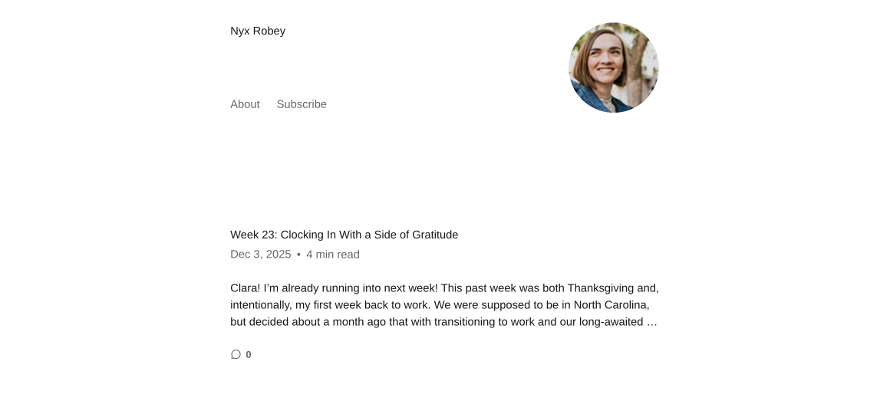

<figure>
  
  <figcaption><a href="https://nyxrobey.com/" target="_blank" rel="noopener noreferrer">nyxrobey.com</a> running a minimal theme by <a href="https://andersnoren.se/" target="_blank" rel="noopener noreferrer">Anders Norén</a></figcaption>
</figure>

This is an excerpt from a reflection I’ve overthought way too much. And since it’s been ages since I last wrote here, I figured: why not just drop it?

---

Technology has always been a double-edged sword for me. Software that aligns with how I think lifts me up and helps me perform at my best. Outdated tools, on the other hand, just weigh me down.

I’ve often felt like sharing my thoughts—personal, professional, and somewhere in between—but I knew it’d probably turn into something too clunky or overcomplicated. So I usually keep them to myself. Best case? They end up in a note in Obsidian.

Another double-edged sword of mine: I'm a purist, a perfectionist, an overthinker (just spent 15 seconds debating whether _purifectionist_ was legit—just so you get the idea). What does that even mean? I’d lose a night of sleep just to understand the basics of some random idea I came up with. Sometimes it puts me way ahead of the curve; other times it pulls my attention away from actual fires.

A couple of weeks ago, my wife asked me to set up a blog for her so she could write about pregnancy and our newborn daughter. So I swallowed my developer pride and spun up a simple WordPress site for her. And she’s rocking it—posting every few days, writing from the couch, wherever.

Meanwhile, for me to write this tiny post? I had to sit at my desk, pull a local copy of my site from the GitHub repo, and write this thing in markdown with proper formatting. Not ideal. Not practical.

And don’t get me wrong—sometimes you have to get your hands dirty. It’s the only way to build real skill, to be ready to row in any direction when the current changes. But right now? Honestly, I value simplicity. And I can choose it.

This might be the last post in this (semi-)organized chaos. I’ve been toying with the idea of using <a href="https://www.11ty.dev/" target="_blank" rel="noopener noreferrer">Eleventy</a> for a while, so I’ll probably go that route.

**Simplicity always wins.**

