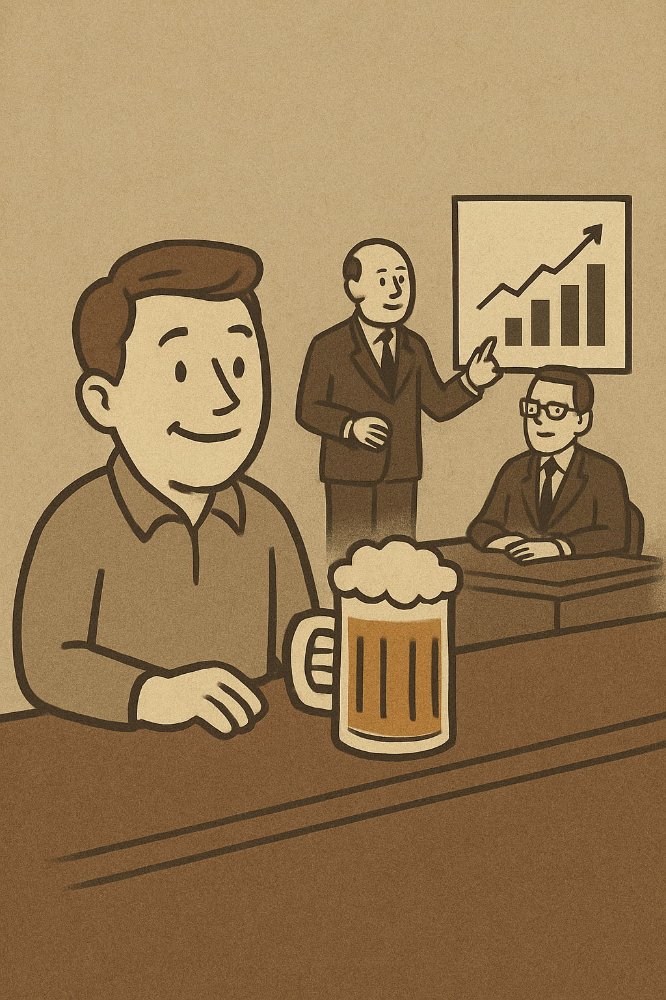

You're chasing attention, not trying to impress your competition.

Teams redesigning and editing right after their competitors made a move. Drop the ego for a second.

Just focus on making it an easy yes for your customer. Win that game today. Then go play in your no-referee league if you want.
