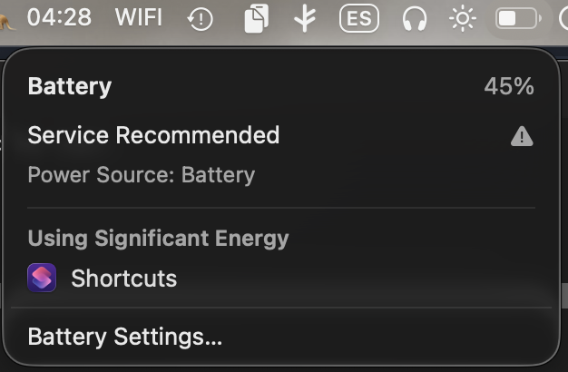

> Note: this isn't fully working. It handles the five native charge-limit states, but macOS hides a sixth one, the one-time full charge override, and won't let me read it. I might come back to this if those internals ever get exposed.

Where I want to land is small. The native charge limit, one click away, in the menu bar. No app to open, no settings dive. That's the whole target.

First decision: build it on <a href="https://swiftbar.app/" target="_blank" rel="noopener noreferrer">SwiftBar</a>. A menu bar plugin that runs a script and shows its output. Good enough to hold a toggle.

Second decision: the steps. I adhere to Mac's own, knowing they'll probably change. Why five and not twelve? Why start at 80? Why is 100 no limit? Fragile design decisions, honestly. But Apple knows how to make it easy for everyone, and that's fair.

```bash
readonly STEPS=(80 85 90 95 100)     # 100 = no limit
```

So a click just walks the list and wraps around. The match is the whole toggle.

```bash
for (( i = 0; i < ${#STEPS[@]}; i++ )); do
  [[ "${STEPS[$i]}" == "$cur" ]] && { next=${STEPS[$(( (i + 1) % ${#STEPS[@]} ))]}; break; }
done
nohup shortcuts run "Battery $next" >/dev/null 2>&1 &
```

Then reality splits in two. Reading the limit is easy, it lives in a plist.

```bash
pols = [o for o in objs if "soclimit" in o and not o.get("terminated")]
print(min((int(p["soclimit"]) for p in pols), default=100))
```

Writing it isn't, macOS gives no public way in. So the compromise: each step fires a Shortcut. It works, but it leaks. In the battery menu my toggle now shows under *Using Significant Energy: Shortcuts*. A little ugly, honest about what it is.

<figure>
  
</figure>

For a while I'm there. The target is met. Then macOS shows me a sixth state I didn't plan for.

**Charge to Full Now.** A one-time override: charge past your limit once, then fall back at 6am the next day. It only lives here, only reachable from Battery. It isn't even in the shot above, it only appears when charge is level-blocked with the cable connected.

Here's the thing I keep noticing without a clean name for it. Call it word design. The way a system uses placement and wording to softly tell you *this won't work, don't touch it, it's tucked away*. Nothing forbids you. It just leans on you until you drop it.

So the next decision is to not drop it. I go look for the state everywhere it could hide.

```bash
# powerd.charging.plist soclimit · SMC CHTE/CH0B · ioreg AppleSmartBattery
# ChargerData · IOKit IOPSKeys · powerd unified log · Shortcuts Get Charge Limit
```

None of it reads the override. Apple exposes it only as a cap at 100, which is to say no cap. But internally it isn't no cap, it's a full charge on a timer. Not the same thing. It's unreadable by design.

So I try to adhere to their fragile design one more time, by guessing. If the battery is charging and I know a cap was set, but the plist now reads 100, that combination is very likely the override running.

```bash
last_cap=$(cat "$CAP")                        # last non-100 cap, retained
now=$(read_limit)                             # reads 100 while override runs
charging=$(pmset -g batt | grep -q '; charging' && echo 1)

if [[ -n "$charging" && -n "$last_cap" && "$now" == 100 ]]; then
  lbl="NL"          # override on, reverts ~6am to $last_cap
fi
```

This is the code I don't ship. In my logic it collapses to NL, indistinguishable from a real no limit, and then at 6am it snaps back to the cap I had. Not ridiculously wrong, just imprecise. Fully functional if you want it. So I leave it here, in case you do.

The last decision is the honest one. The plugin knows five states and stays blind to the sixth. I stop, and I leave the gap in plain sight instead of faking it. Maybe I come back to this someday. For now it sits there, mostly working, with one door macOS won't let me open.
