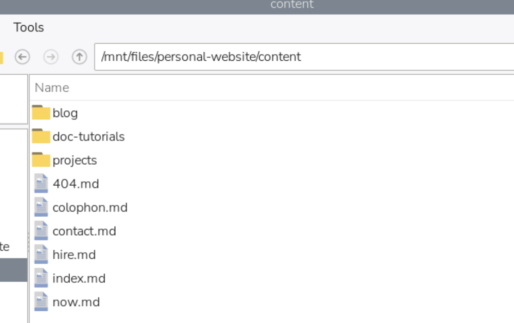
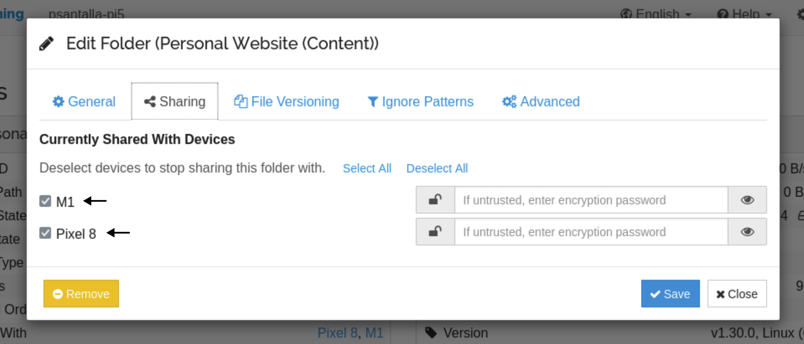

The content of my site (`/content`) is a set of markdown files (with accompanying media) that Eleventy compiles to HTML.

`/content` lives in a [repository](https://github.com/psantalla/pablo-website-v2), cloned on my local machine (a MacBook).


From that local copy on my MacBook, `/content` is synced via [Syncthing](https://syncthing.net/) with a folder on a hard drive connected to a Raspberry Pi.



The Pi doesn't only sync with my MacBook — it also syncs with my phone. Syncthing lets you re-distribute the same content to more devices from a single sync node.



Here's what we've got so far:

1. A GitHub repository holds the site, including the `/content` folder.
2. The full repository is cloned on my MacBook.
3. The MacBook syncs the files inside `/content` with a drive attached to a Raspberry Pi.
4. The Pi also syncs that content with my phone.

I also keep a vault of notes and files synced between my phone and my MacBook. That vault contains the website's content files too.


So the MacBook intentionally holds replicas of a few things:

* The website's content files inside `/content`.
* The files in the vault that's synced with my phone.

These replicas live inside Syncthing's sync flow on purpose, which avoids conflicts that would arise from any process outside that flow touching the same files.

## Automatic publishing

Obsidian is convenient for editing markdown. For publishing, I'd rather lean on an independent Git system.

There are Obsidian plugins that would resolve a commit from inside the app, but the mobile integration has been reported as unstable, and I don't want the publishing path to depend on it.

The Raspberry Pi is always on. It's the stable node of the system.

`/content` lives in the repo next to project scaffolding: Nunjucks templates, Eleventy config, build data. The Pi doesn't need any of that — it's a content node, not a code node.

Syncthing filters at the source. Ignore patterns on the Pi exclude `.njk`, `.js`, `/feed`, `.virtual` from the transfer. What arrives on the Pi is content only: markdown, images, video.

The repository is cloned on the Pi with sparse-checkout, so only `/content` lives on disk, alongside the root files that sparse-checkout's cone mode includes by convention.

A `cron` job runs every five minutes:

```
*/5 * * * * /home/psantalla/bin/sync-content.sh
```

The script pulls with rebase and autostash first, so anything I push directly from the MacBook or from GitHub web comes down before new local changes get committed. Then it stages everything under `/content`, commits if there's a diff, and pushes.

If the push is rejected because the remote moved in between, the script pulls again and retries once. If Syncthing left a conflict file behind, the script skips it — those mean two devices edited the same file at the same time and I want to resolve them by hand.

A `flock` keeps two runs from overlapping. A guard at the top aborts cleanly if the repo is mid-rebase or mid-merge.

`cron` because it needs no dependencies, starts with the system, and requires no maintenance. No daemons, no extra processes.

The push triggers GitHub Actions. Eleventy compiles. The site updates.

Logs live in `/mnt/files/pablo/logs/`, rotated weekly.
