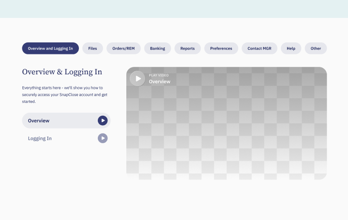
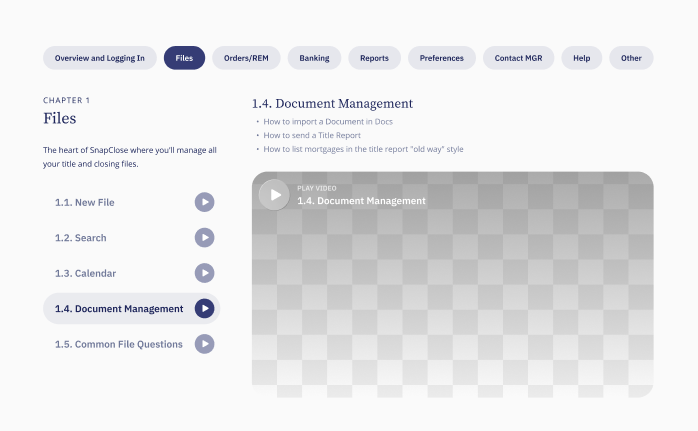

Probando el workflow.

> This is a typical tab implementation in <a href="https://avada.com" target="_blank" rel="noopener noreferrer">Avada</a>. Some page builders don't include this functionality out of the box, but it's a basic JavaScript pattern. Here I've summarized my notes and process for tackling it, including some useful observations for improving team workflows.

## General Notes



It's a double tab. The first one should be straightforward, but I'm already thinking I'll need ACF if I want to avoid a mess of conditional sections. The problem comes when each section is different.

Something to communicate to the design team: from now on we should pay more attention to consistency, making it easier to implement without having to rely on conditionals.



Sometimes, the column containing the video also has a text block above it. The only way to accommodate both situations—with and without the text block—is through a conditional.

## Technical Ideas & Requirements

This might be a good time to test <a href="https://wordpress.org/plugins/pods/" target="_blank" rel="noopener noreferrer">Pods</a>, an alternative to ACF Pro. Either way, I still need to implement the design. If Pods works out, the steps would be:

1. Implement a static layout
2. Install Pods and test it. Check if it has a repeater field option, looks like there's some documentation <a href="https://docs.pods.io/fields/simple-repeatable-fields/" target="_blank" rel="noopener noreferrer">here</a>
3. Create the necessary fields in Pods
4. Embed the setup into the static layout
5. Create JavaScript logic to make the tabs work

### JavaScript Logic

```javascript
const initTabs = (wrapper, tabSel, panelSel) => {
  const tabs = wrapper.querySelectorAll(tabSel);
  const panels = wrapper.querySelectorAll(panelSel);

  const activate = i => {
    tabs.forEach((tab, index) => tab.classList.toggle("active", index === i));
    panels.forEach((panel, index) => panel.style.display = index === i ? "block" : "none");
  };

  tabs.forEach((tab, i) => tab.onclick = () => activate(i));
  activate(0);
};
```

### If Not Using Pods

1. Implement a static layout. Name sections so they can be easily located
2. Duplicate the implementation as many times as needed
3. Create JavaScript logic

Basically, there are two implementation paths: one that prioritizes scalability and one that prioritizes time. Implementing a static layout is a common step for both, so that's where I can start.

### Avada-Specific Approach

In Avada I won't be able to properly implement a repeater field. What I could do instead is display elements through a shortcode generated in PHP that handles the logic. If I go down this implementation path, the right approach would be:

- Use postcards, so I can call the 'tutorial' CPT and ideally apply an entrance animation to the column
- Fill each postcard with a PHP structure that allows calling each video

## Tweaking the Setup to My Liking

Someone enabled responsive typography in Avada. I'd like to disable it to set my own font sizing rules.

There's a way to fix this in Avada, and it's forcing the following: `--typography_sensitivity: 0;`

This makes the font size definition unaffected by the scaling factor that Avada applies.

One way to apply it per page, so it overrides the default values:

```html
<style>
	:root {
	  --typography_sensitivity: 0 !important;
	}
</style>
```

That above, applied as inline within a `style` tag would solve it, but if we want to apply it from a stylesheet, more appropriately, it would look like this:

```css
/* where n is the page ID you don't want the auto-scale to be applied */
.page-id-n * {
  --typography_sensitivity: 0 !important;
}
```
