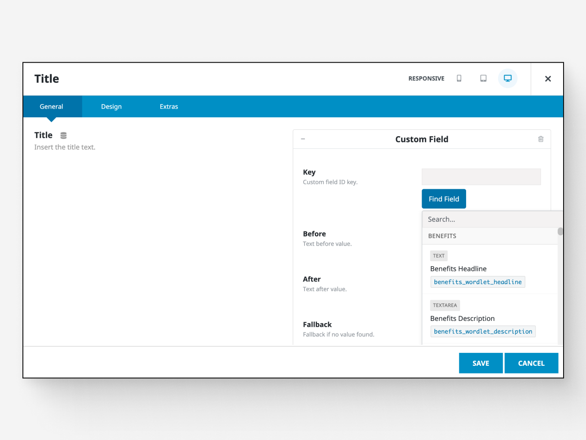
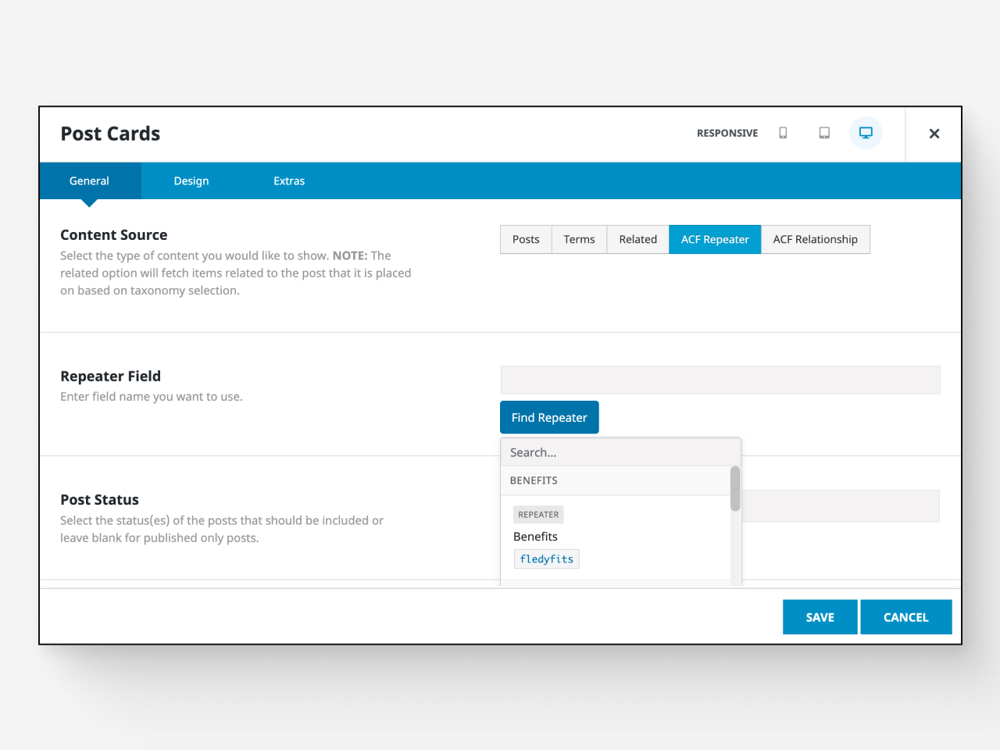

This WordPress plugin is in review for the official repository. Some delays are related to naming and proper conventions (e.g., copyright considerations).

The plugin is fully functional and **tested in production environments**. It works with the Avada theme, displaying configured ACF fields and organizing them by field group.

Other features that make this plugin a solid alternative:

- Streamlines workflow with ACF by keeping all field keys accessible. This isn't part of Avada, and there are no plans to add it.
- Displays fields based on the element being edited. For example, text fields appear when editing a title, while irrelevant fields stay hidden. Supported elements include:
  - Repeater fields, structured according to ACF and Avada best practices
  - Search works with builder conditionals (tested with the latest Avada updates; see the <a href="https://avada.com/documentation/avada-changelog/" target="_blank" rel="noopener noreferrer">changelog</a>)
  - Image and gallery fields

The plugin is non-commercial, fully open-source, and the code is available in the repository for anyone to use and inspect.
