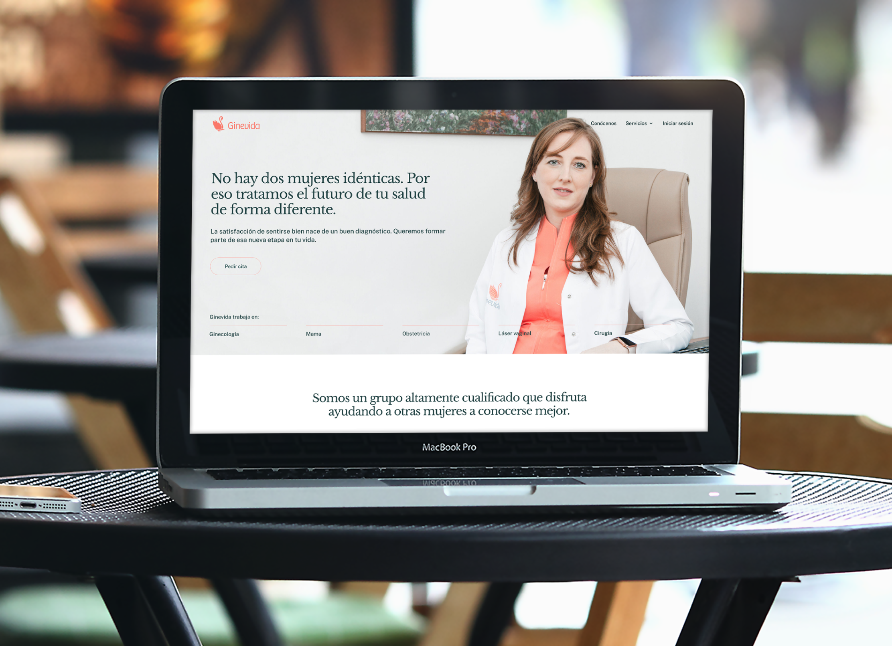
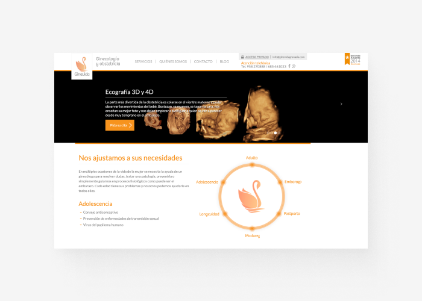
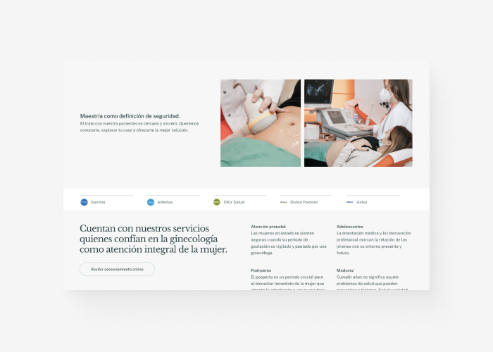
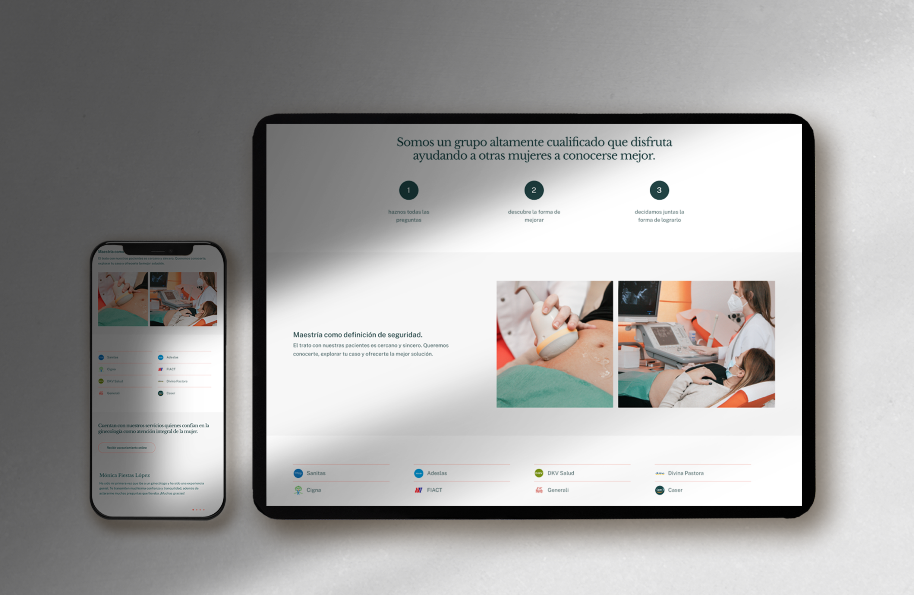



Ginevida is an obstetrics clinic in Granada, Spain, dedicated to growth and staying connected with their patients through digital solutions like telemedicine and user-friendly web integrations.

## Project overview

- **500+ patient registrations** due to an accessible interface that allows efficient communication and appointment booking
- **2-way calendar sync** allowing bidirectional updates between the web app and doctors' schedules
- **19 services managed** through a dynamic booking system with responses monitored by healthcare staff daily

> "It has been and continues to be a pleasure to work with him. Using a practical and functional approach, he can listen to your ideas and make them happen. The result was extraordinary."
>
> **Irene Vico**, Director at Ginevida

## The challenge

Although the client presented it as a redesign of the current website, I quickly realized that the real challenge was to lead patients of diverse ages and backgrounds through a seemingly complicated booking process. The website needed to provide multiple services to patients, delivered by various doctors on different calendars, creating an even greater challenge.

<figure>

<figcaption>Previous to the new design. There were good ideas underneath, but the execution didn't transmit them clearly and the site was hard to navigate.</figcaption>
</figure>

## The approach

I split the redesign into stages, with a first viable launch that doubled as the new brand surface and left room to grow into the online services the clinic wanted to offer over time.

The backend had to be rich for the staff while remaining quietly simple for patients. Tone of voice, complexity, directness, content segmentation, visual cues, engagement balance, scalability. Each one was a lever to set with the client before writing a line of code. My role at the start was to listen, surface their strongest points, and make sure we were aligned before touching analytics.

## Booking, made boring on purpose

Genevida's team and I built a booking system that's complex underneath and uneventful on top. Nineteen services, two-way calendar sync, and a flow that doesn't get in the way of the patient.

{{ vc.figure("videocase-ginevida.mp4", "A glimpse into the booking process.", 1920, 1080) }}

## A reflection of the service

The foundation for a 360° site was the clinic itself. The team avoided aggressive marketing; the goal was making it easy to find the right information at the right moment. We anticipated patient behaviour by age, urgency, and expectation, and took a real mobile-first approach: people booking from the couch, the bus, or a weekend afternoon.

