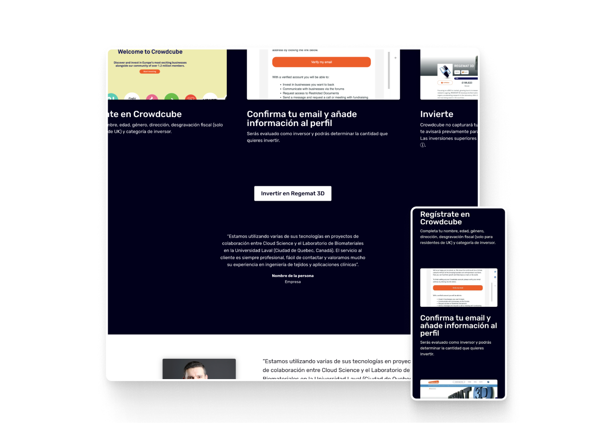
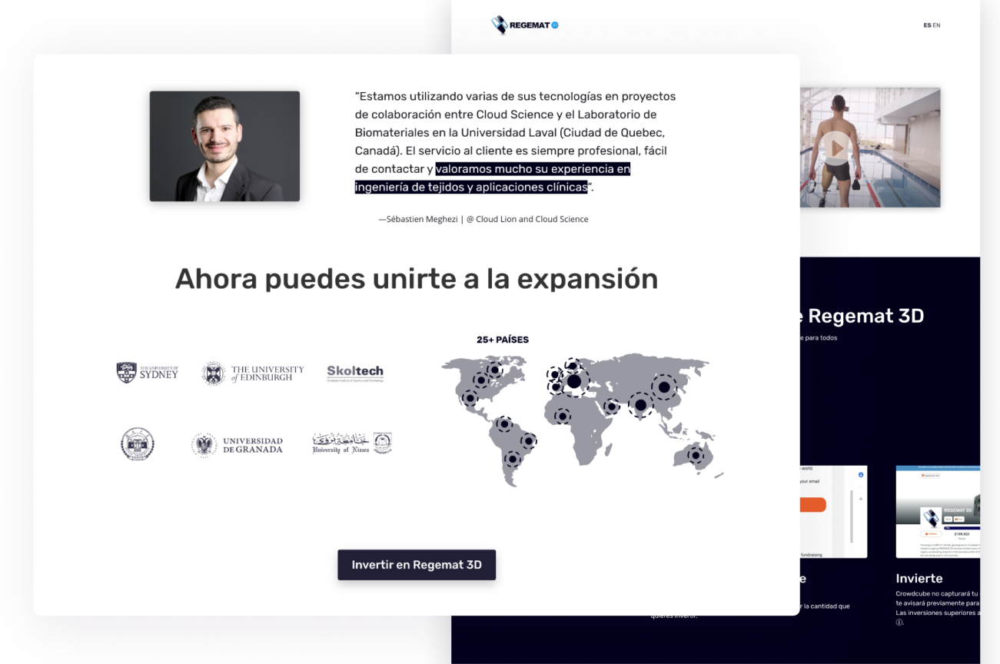
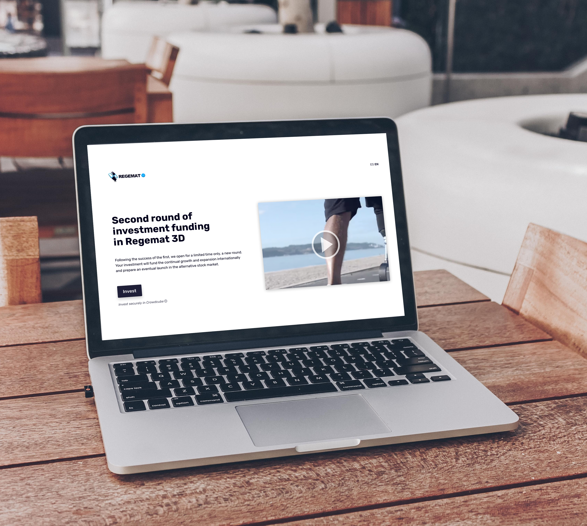

## Overview of the project

- **€500K+ raised** — A funding round launched on the Crowdcube platform. This platform sets minimum funding thresholds to ensure the viability of the company's participation in investment rounds.
- **485 investors** — In its second funding round, Regemat 3D was more exposed to the media than ever before, showcasing products of significant value in the biotechnology sector and capturing the attention of small and medium-sized investors.
- **147% of the target** — Not only did the company meet the requirements for participation and funding amount on the investment platform, but it also surpassed the company's objectives.

## The challenge

A campaign was on the verge of launching. It boasted high-quality video content, informative resources, a well-established project, and an experienced team. However, there was a missing connection between user interest and the opportunity to attract investors. Undoubtedly, this posed a critical situation and a crucial milestone for the company's development. We felt a strong sense of responsibility but were also confident that our excellent communication with Regemat 3D would pave the way for the project's success.

<figure>

<figcaption>This design is not part of the project</figcaption>
</figure>

## The approach

Our focus was on understanding the user's motivations for investing in the company. We needed to identify when, why, and under what circumstances they chose to participate in the funding round. Additionally, since we were using a third-party platform with its own statistical system, we had to integrate its data with ours for better insights. Our first step was to communicate the significant impact of Regemat 3D's product and its potential value to the users.

We were fortunate to discover points at which potential investors might lose interest or forget the value of Regemat 3D. Due to regulations, the investment process appeared to be cumbersome or less intuitive for some users.

We were going to divide the investing process into four steps and explain what could be obtained after each one. The functionality for presenting the process had to be elegant and convey simplicity: concise text, real illustrations of the process, and images tailored to engaged investors.

## User-friendly guidance and seamless continuity

<video autoplay loop muted playsinline>
  <source src="regemat-video-landing.mp4" type="video/mp4">
</video>

The navigation on the landing page is straightforward, using tooltips to expand on legal content or information that may not be understood by some users, and diverting the natural flow of navigation to introduce the user to the explanation of the investment process. The remaining elements focus on showcasing Regemat's authority and optimizing the CTAs.

## Expanding reach with a multilingual page

Our project's target audience encompasses English and Spanish-speaking countries, including Australia, Canada, the United States, England, Spain, and Latin America. The page's loading process detects the user's browser language and provides an optimized version accordingly. Additionally, statistical tracking is implemented across the various page versions. We've also taken into account all video and explanatory content.

## Recognition and results

The success of this work hinges on effective communication, support, and the adept utilization of marketing tools. Media recognition continued to support Regemat 3D's endeavors following the campaign.

In their articles, <a href="https://3dprintingindustry.com/news/regemat-3d-raises-over-e500k-in-effort-to-advance-its-3d-bioprinting-technology-210011/" target="_blank" rel="noopener noreferrer">3D Printing Industry</a> recognized Regemat 3D's achievement in advancing its 3D bioprinting technology, while <a href="https://www.voxelmatters.com/lab-grown-plant-material-for-3d-printing-developed-by-mit-researchers/" target="_blank" rel="noopener noreferrer">VoxelMatters</a> highlighted Regemat3D's success in raising funds through a second round of equity crowdfunding.

This approach acknowledges that effective design is a blend of aesthetics, functionality, and empathy for the user's journey. It's about crafting a digital space that feels intuitive and purposeful, aligning with the user's expectations and objectives. In essence, it's the harmony between user-centricity and company goals.

