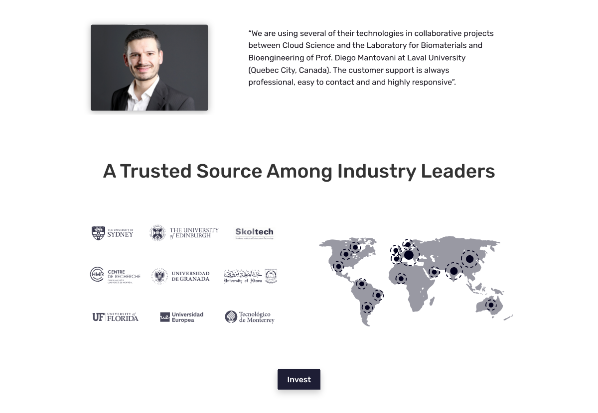
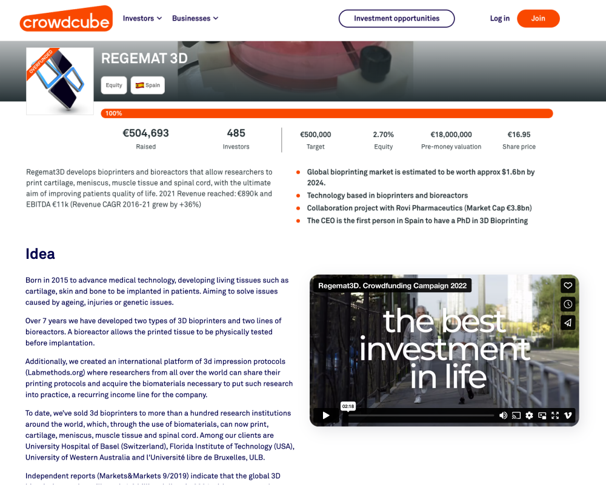

## Overview of the project

- **€500K+ raised** — A funding round launched on the Crowdcube platform. This platform sets minimum funding thresholds to ensure the viability of the company's participation in investment rounds.
- **485 investors** — In its second funding round, Regemat 3D was more exposed to the media than ever before, showcasing products of significant value in the biotechnology sector and capturing the attention of small and medium-sized investors.
- **147% of the target** — Not only did the company meet the requirements for participation and funding amount on the investment platform, but it also surpassed the company's objectives.

## The challenge

A campaign was on the verge of launching. It boasted high-quality video content, informative resources, a well-established project, and an experienced team. However, there was a missing connection between user interest and the opportunity to attract investors. Undoubtedly, this posed a critical situation and a crucial milestone for the company's development. We felt a strong sense of responsibility but were also confident that our excellent communication with Regemat 3D would pave the way for the project's success.

<figure>

<figcaption>This design is not part of the project</figcaption>
</figure>

## The approach
